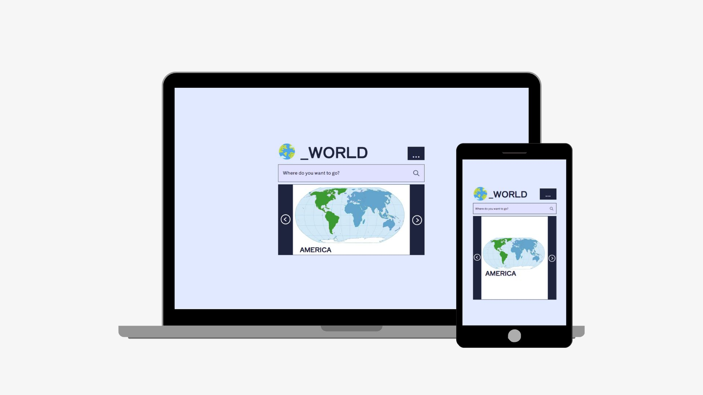

# _world countries

## Sobre
O objetivo do projeto é aplicar os conhecimentos adiquiridos sobre consumo de APIs, para a matéria de Programação Web Front-End

### Funcionalidades 
- Apresenta informações sobre os países do mundo:
      - por continente;
      - por nome do país;

  [Rest Countries API](https://restcountries.com/)

## Ferramentas

## Layout 
[Criado com o Figma](https://www.figma.com/file/Fz1zupmfNGBMycAwQNR7eJ/_world?type=design&node-id=0%3A1&mode=design&t=UkErC4lteGApcblm-1)

## Autor
[Estela Alves de Moraes](https://github.com/estelalm)
